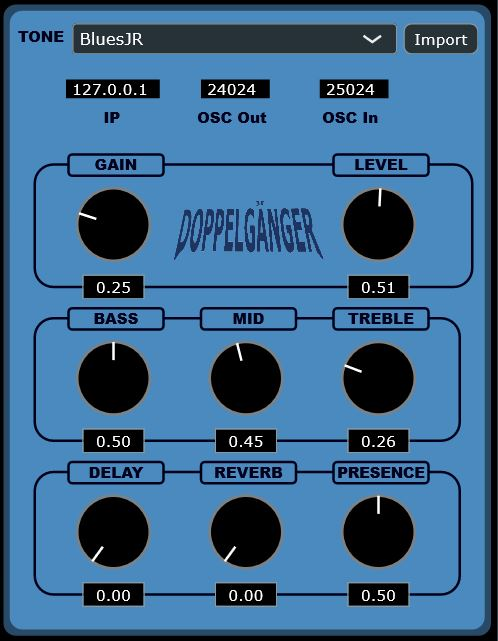

# The Doppelganger

The Doppelganger is a machine learning powered guitar pedal that uses nerual network models to emulate existing guitar effects real-time. All together, the Doppelganger is a VST 
plugin hosted on a raspberry pi. Different models for pedals and amplifiers can be loaded into the plugin and further customized with a variety of parameters (Gain, 
Master level, 3 band EQ, Reverb, Delay, and Presence). Model selection and parameter adjustment can be done over internet connection with a remote instance of the 
plugin.  
  
## Current Plugin UI  
  
  
  
## Elk and Sushi  
The Raspberry Pi 4 used for this project is running on [Elk Audio OS](https://www.elk.audio/), which is
a Linux distribution optimized for digital signal processing performance. The plugin is stored in
the 'Plugins' directory and excecuted with Sushi, Elk's built-in DAW.  
  
## HiFiBerry  
In order to connect directly to a guitar, the Raspberry Pi is fitted with a DAC/ADC to convert
audio signal from analog to digital for signal processing, and back to analog for speaker output.
The Doppelganger is equipped with a DAC + ADC hat from [HiFiBerry](https://www.hifiberry.com/shop/boards/dealing-with-blocked-p5-holes-8/).  
  
## PedalNetRT  
Original neural network models are trained using [PedalNetRT](https://github.com/GuitarML/PedalNetRT),
a training setup that utilizes pytorch-lightning and RTNeural.  
  
Note: Plugin source code is cloned, updated and in some cases modified from [GuitarML](https://github.com/GuitarML)'s 
open-source NeuralPi plugin.